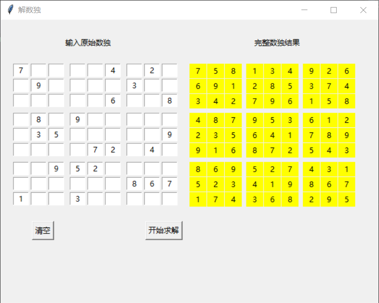

# 解数独小工具

## 简介
在win10下写的，使用的时候运行main.py即可

`python main.py`

原理比较暴力，遍历迭代，不满足条件就回溯。所以为了加快速度，
底层用c++写的，上层的gui用Python写的，这里
使用了python和c++混合编程的库[pybind11](https://github.com/pybind/pybind11.git)
## 不足
未校验输入合法

未校验数独有效

假设输入的数据正确、可解